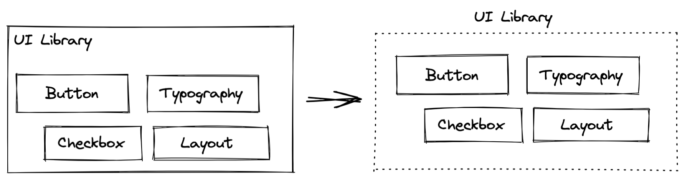

Welcome to the first instalment of the series dedicated to the re-architecture of a UI library. I helped my company to transition from the monolithic setup to a mono-repository by leading this project.

## This is all very familiar

It seems like this is a common topic these days: Deprecate monoliths and move toward micro-frontend/micro-service architecture.

However, many UI libraries start as a monolith. Meaning, there's a single distribution for the whole library. This setup can function for quite some time. However, it has a few important drawbacks:

- it does not provide the autonomy to work on an individual UI component and distribute only that component;
- the only way to release is to release the entire UI library;

## Why is that a problem?

Let's consider a few scenarios. You work in an organisation with many teams who work on a product. Teams' autonomy is one of the factors that make modern organisations move faster. However, a shared among the teams UI library may act as a glue reducing the autonomy.

Now, imagine there was a bug fix in one of the components. In the meantime, somebody else changed the API of another component. This sounds like a good set of changes to be released. However, if we do it, a person waiting for the bug fix will also need to change all the places in their code where that other component is used. Again, autonomy is reduced.

If we zoom out a bit, we'll see that the bigger the changeset, the greater the effort required to adopt a new version of the UI library. This strategy reduces the adoption rate and makes the end product look fragmented as not all teams can catch up. Besides, consumers (other teams in your organisation) depend on the release schedule. Can we improve this?

## What's the solution?

One way to solve the problems I mentioned above is to break this monolith into pieces. Instead of a single NPM package that contains all the UI components, we deliver an NPM package per UI component:



The tooling these days allows a great deal of automation. Therefore, the whole release and version management cycle can be completely automated. In our particular case, we used:

- Lerna with Yarn workspaces
- TypeScript
- Commitizen, Conventional Commits and Commitlint
- Rollup
- Storybook
- Hygen
- ESLint, Prettier, Husky, StyleLint

### Picking a name

It may seem unimportant, but a good name enables lots of good things: NPM namespace, Confluence space, slack channels, internal branding, to name a few.

Our library is called "Highlight UI". It wasn't easy to come up with a good name, but after a few trials, we managed.

### Directory structure

Our project now looks like this (somewhat simplified view):

```
ui-library/
├──📁 node_modules/
├──📁 packages/
|   ├──📁 config/
|   |   ├──📁 base-typescript/
|   |   ├──📁 base-jest/
|   |   └──📁 scripts/
|   └──📁 ui/
|       ├──📁 checkbox/
|       ├──📁 button/
|     <...>
├──📝 package.json
├──📝 tsconfig.json
```

There are two workspaces: `config` and `ui`. This leaves the potential to add more workspaces to separate things logically.

Notice, there are `base-typescript` and `base-jest` configuration packages. Any other `tsconfig.json` or `jest.config.js` extends the configs from those packages. Finally, there is a package with some `scripts` that contains build/cleanup/storybook runner/etc tools. Very handle to encapsulate a lot of build dependencies and provide meaningful defaults and upgrade strategy.

### Structure of the package

Each package looks like a normal NPM package:

```
📁 ui-library/packages/ui/button/
├──📁 build/
|  ├──📝 build.es5.json
|  └──📝 build.es2015.json
├──📁 node_modules/
├──📁 src/
├──📁 tests/
├──📁 stories/
├──📝 index.tsx
├──📝 tsconfig.json
├──📝 package.json
├──📝 README.md
└──📝 CHANGELOG.md
```

In our stories, we decided to import from the `index.tsx` file. This way, we can control what kind of interface a package exposes. We use a similar recommendation for tests, but it is not as strict.

A typical package.json file will look something like this:

```json
{
  "name": "@highlight-ui/button",
  "version": "8.0.1",
  "main": "dist/cjs/index.js",
  "module": "dist/esm/index.js",
  "types": "dist/cjs/index.d.ts",
  "style": "dist/index.css",
  "files": ["dist"],
  "scripts": {
    "test": "jest",
    "clean": "highlight-cleanup",
    "build": "highlight-build",
    "sb:dev": "highlight-storybook"
  },
  "dependencies": {
    "@highlight-ui/icon": "^3.0.17"
    // ...
  },
  "devDependencies": {
    "classnames": "^2.3.1",
    "react": "^17.0.0"
    //...
  },
  "peerDependencies": {
    "classnames": "^2.3.1",
    "react": "^17.0.0"
  }
}
```

Nothing groundbreaking. But notice how 3rd party dependencies are treated. We can ask consumers to install specific versions of `react` and `classnames`.

## How to consume it?

Treat every package as a 3rd party. Simply install the individual packages:

```
yarn add @highlight-ui/button
```

This way, the consumer will only install a collection of packages, each containing one and only UI component, that they need. Unless one or more packages added as dependencies are “heavy“ (with a “heavy” external dependency, in KB), the impact on the total bundle size of an app is going to be only a fraction of all dependencies.

## Versioning and releases

A version for each package is calculated automatically thanks to semantic-release. This can be achieved on CI based on the commit messages (Conventional commits + Commitizen) or a special file (depending on tooling).

## Deprecation

In general, as practice shows, just releasing a new version suffice.

However, NPM has a special command to deprecate packages and version(s). This process can be automated using CI. What is needed is a special job that will run only when there's a special file with packages, versions and deprecation message. After the deprecation is done, CI can clean up this file.

## Adding a new component to the library

A new package can be scaffolded using a template. We use `Hygen` - works very well and helps contributors to start a new package with almost no guidance.

## Dependencies between packages

Some packages are going to depend on each other and that’s okay.

For example, almost every UI-related package will depend on the `theme` or `utils`.

Tools like `Lerna` can help automating versioning. We use `commitizen` and `conventional commits` to write commit messages in a specific format that can be parsed by Lerna to determine the next version of the changed packaged.

Apart from writing code, this is the only thing the other engineers need to think about. The rest is automated.

For example, a `pagination@0.3.1` depends on the `button@0.1.14`. Now, due to a new feature, the Button becomes `0.2.0`. In this case, pagination gets a patch `0.3.1 -> 0.3.2` and the version of the Button in its `package.json`.

## Autonomy

Each package is autonomous and can be released separately. The shared parts (`utils`, `theme`, etc.) are as thing/small as possible and change rarely.

## Room for experimentation

When each package is isolated, this allows contributors to experiments with tooling and approaches without affecting the whole library. For example, one package can be built using rollup, another can be built using webpack.

## Conclusion

Thank you making this far! I hope you found it useful. I would like to invite to [the Part 2: handing CSS dependencies](/ui-lib-monorepo-part2/)
