Let's talk about CSS files and modules. Unfortunately, they are often treated as if they were a second class entities. We need to fix this situation.

## Treating CSS dependencies the way we treat other dependencies

Let's talk about the dependencies between UI components.

In JS files, we mark dependencies by `import`-ing or `require`-ing them. Packages clearly define dependencies in the `package.json` file. But a package is not only JS files, but also CSS files.

Consider a typical app:

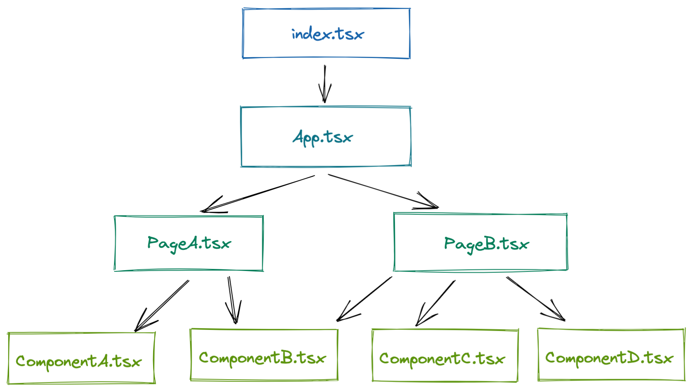

Basically, it is a directed graph of dependencies between components. This is our mental model - JS files that reference each other. And it works well as each of those app-specific components import their CSS file and a bundler takes care of reducing all this to 2-3 files.

But let's keep in mind that we're building a set of NPM packages that contain JS and CSS files. For example, the `Button` package depends on the `Icon` package. This means, there's a dependency between JS _and CSS_ files. However, typically, these relations are neglected.

```js
// button/index.js
var Icon = require("@highlight-ui/icon");
```

```css
/* button/index.css */
/* where's my Icon? */
.Button-module {
  /*...*/
}
```

Therefore, we decided to introduce such dependency declarations in CSS files as well.

This way, we get the full picture, like shown on this diagram:

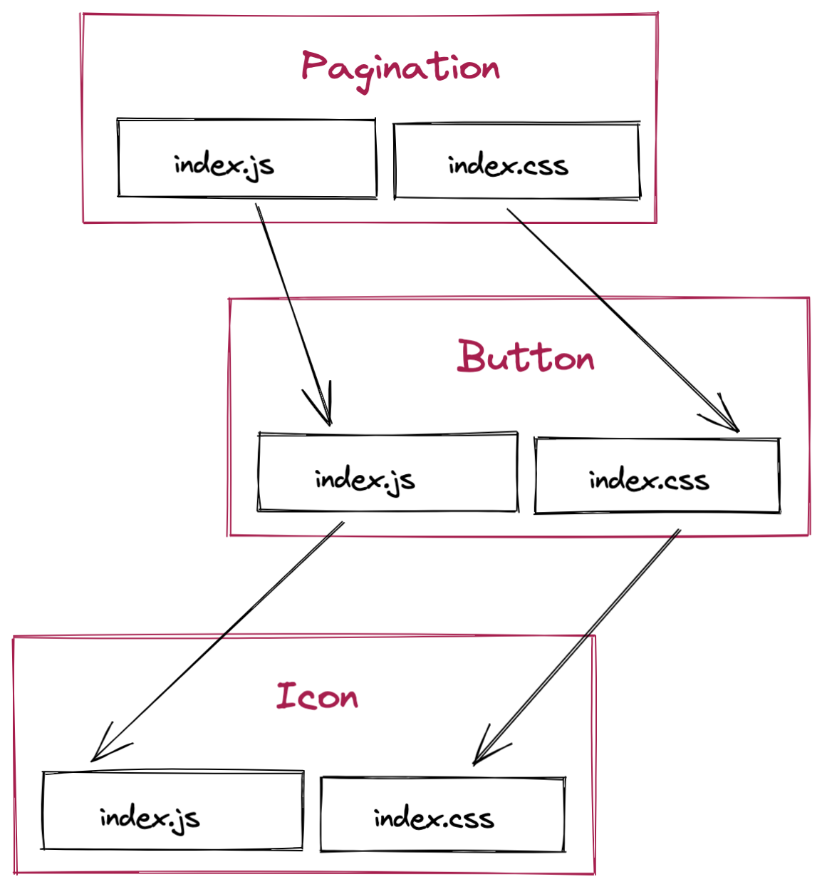

## Let’s test it

Let's make our Button’s Sass file include the dependency:

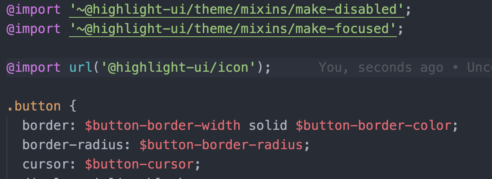

just as we do in the TS file:

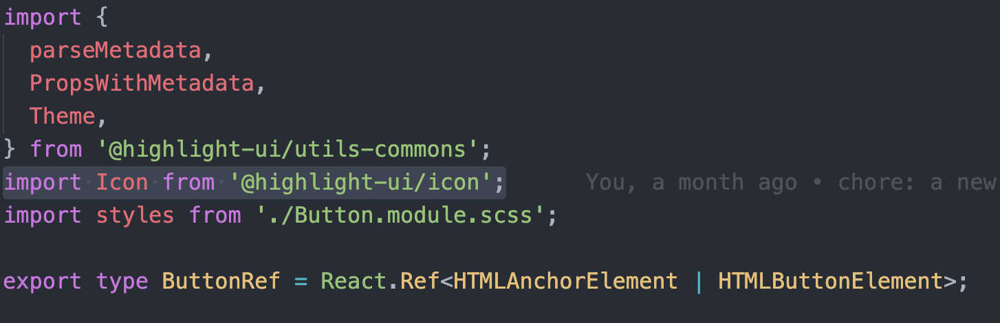

The resulting build looks like this:

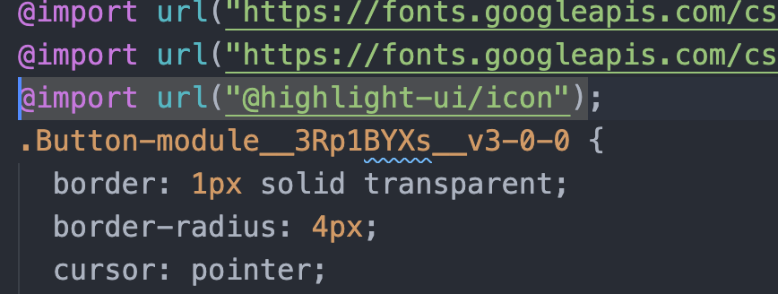

At this moment, we have the Button at version 3.0.0, which depends on the Icon at version 2.0.6.

Great. Now, let’s go back to our App and install the Button package. We used `yalc` for the local experiments as it replicated the whole release-publish-install cycle:

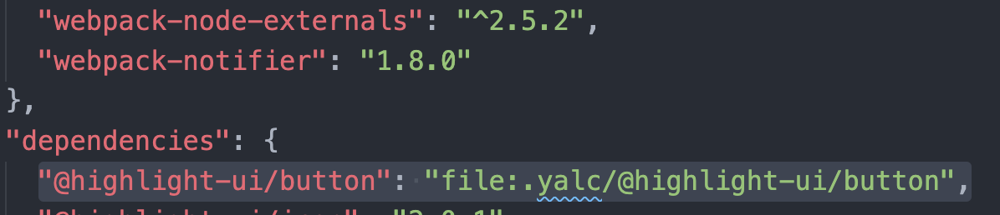

Now let's use the Button in our App. This the `app.tsx`:

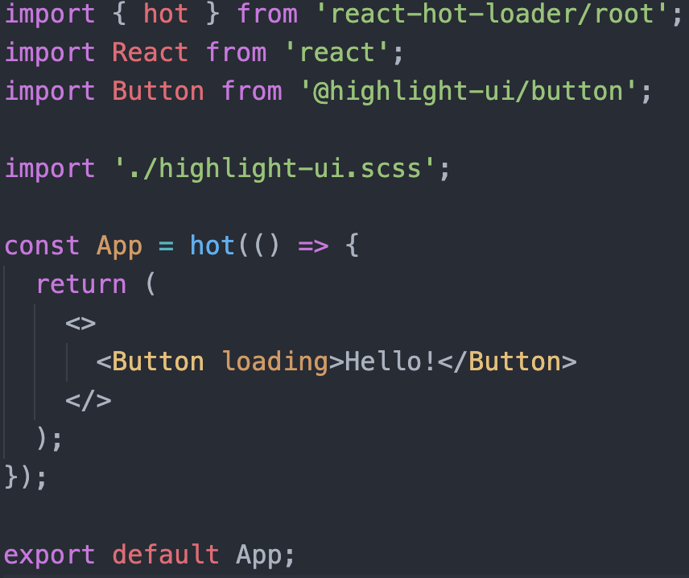

In our App we have a special file where we `@include` the CSS of our components.

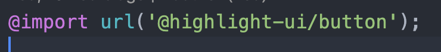

When we built it, we got the following results:

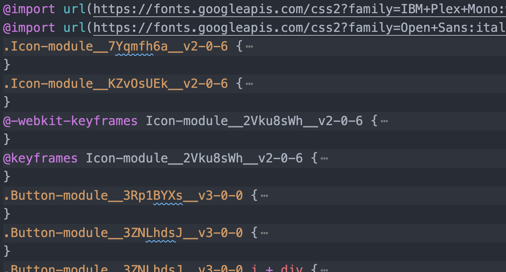

Notice that because there was an `@import` in the Button's CSS, Icon’s CSS was included as well, thanks to `css-loader`.

However, what if our App already had Icon as a dependency? Let’s simulate this and install the Icon package of version, say, 2.0.1:

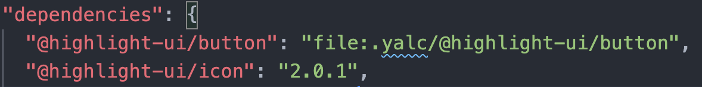

To summarise, the Button v3.0.0 depends on the Icon v2.0.6, our App depends on Icon v2.0.1 and the Button v3.0.0: Our dependency tree will look like this:

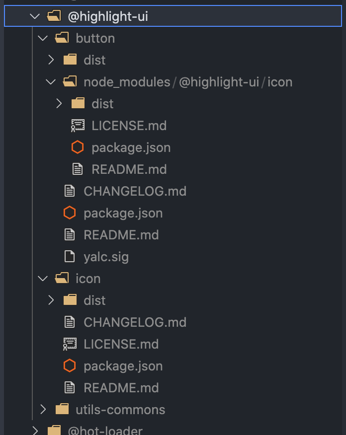

_Note: `button` package now has its `node_modules` with `icon` package._

We’ll include it in source files, `app.tsx`:

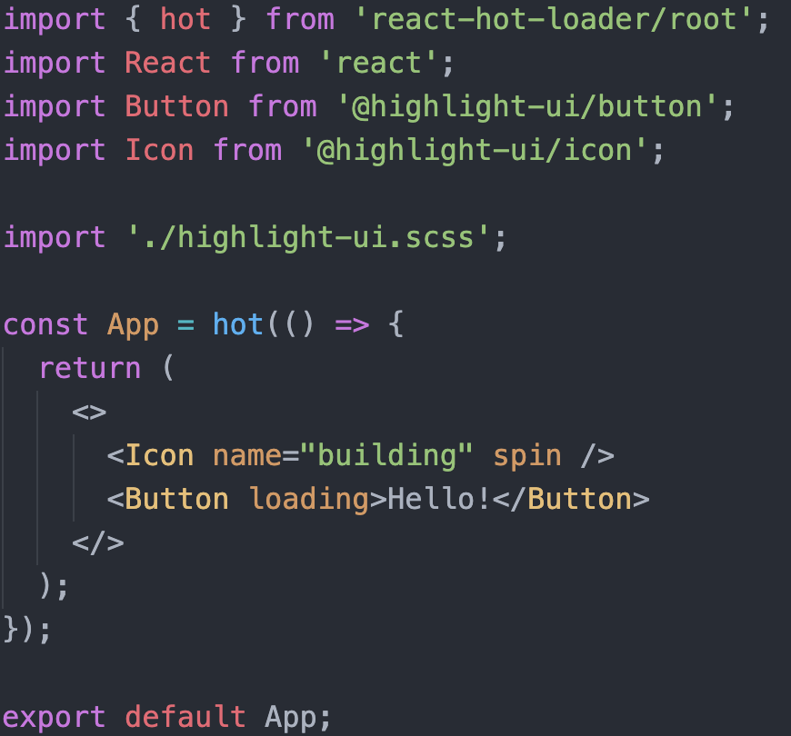

as well as in the `highlight-ui.scss`:

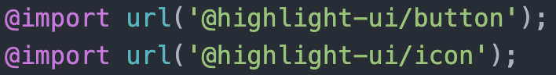

Let’s build it now and see what happens:

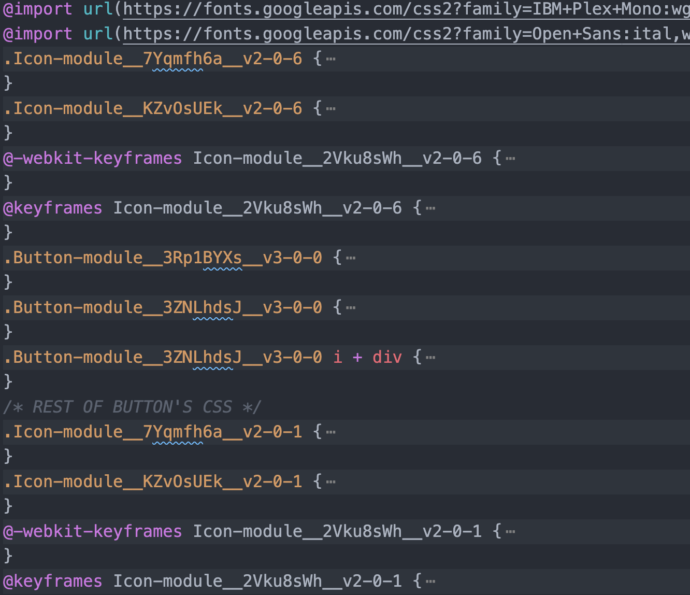

Okay, both versions are there!

However, what about JS? In JS we also reference CSS classes. Well, in the browser everything works as expected as well. This is the screenshot of Chrome DevTools:

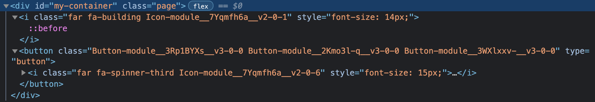

How cool is that to have all these dependenceis visible here!

## Conclusion

It turned out that thinking about CSS files as any other software modules helps building a system of healthy relationship between these modules.
I would like to invite to [the Part 3: improving the developer experience](/ui-lib-monorepo-part3/)
