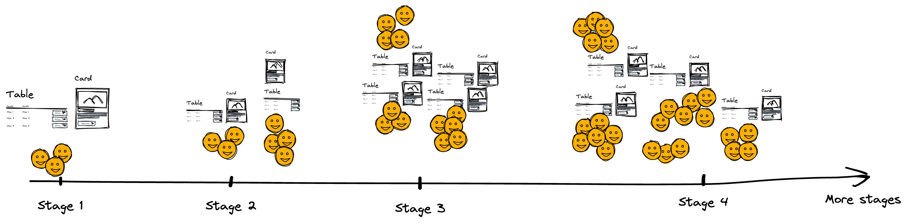
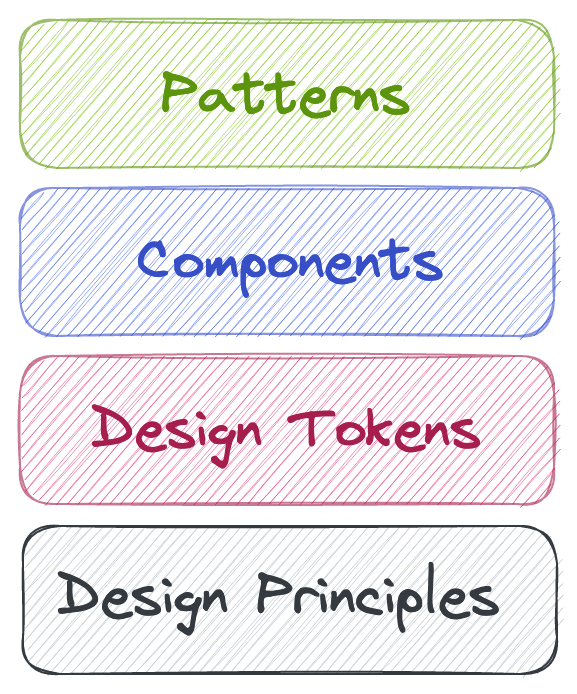
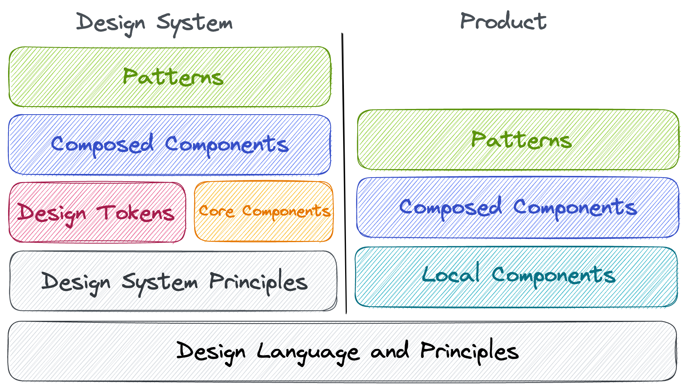
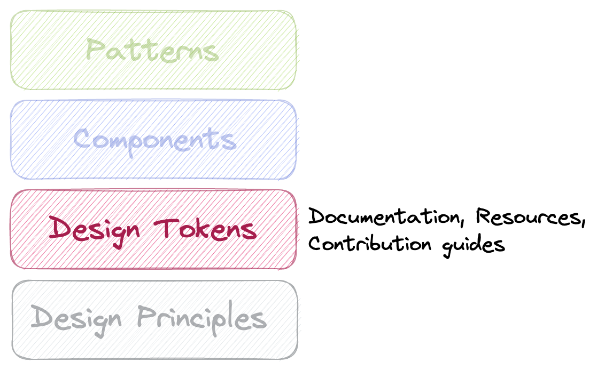

How do we structure a Design System? How do we make sure the architecture allows more people to contribute to it? What if there's already a Design System in place, but it doesn't work? During my time at Personio, I participated in the process of re-thinking the existing Design System. I noticed that dissecting the system into layers helped us answer some tricky questions. So, bear with me.

## How it all starts

In my experience, design systems always come after the main Product. Let me explain. A newly founded company focuses on the Product and go-to-market first. Put yourself into the shoes of a founder. You want to launch as soon as possible. Therefore, to speed things up, you may buy a theme for your framework from one of the marketplaces, or you'll get a ready-made UI kit like Material UI. You need to launch.

As the Product (and the company) grows, more people join the company and form more teams to ship more features. Communication effort grows despite the great tooling in place. Tools are tools - they don't bring the order. Without a way to steer the development of the Product, the final result will naturally look very fragmented and disjoint. Not to mention the time (equals money) wasted on the re-implementation of existing pieces due to a lack of communication.

However, at some point in time, these problems become too big to be postponed. People in the organisation realise this and start systematising the workflows and solutions to common challenges. As a result, a Design System enters the game.

## Quick wins are not always wins

The stumbling block here is the desire to be as productive as possible from the get-go. Naturally, people want to have a lot of value with minimal investment. For example, engineers will build a library of reusable UI components. Designers will do a similar thing in a tool of their choice. Maybe even define some design tokens like colours or typography variants.

After some time, we end up with a disjoint collection of similar pieces for designers and engineers. We have a lot of meetings to discuss what to do with the existing components and the discrepancies between them. Our Product ends up with 150-odd colours instead of 40. On top of that, the company lives its life: people come and go, taking away the knowledge and bringing new ideas, business expands to the new markets, releases need to happen. Exciting!

## Time to clean up

So, we're in a growing organisation. We have a mature yet ever-evolving Product. But our design system is all over the place. What do we do? Is it a good time to start from scratch? Not necessarily. Let's think.

The word system implies structure. We need to organise our design system in a way that allows further improvements. What if we think about a design system as a collection of layers? I call this a Layered-Cake DS Architecture.

This picture exemplifies a generalised idea. In reality, every organisation needs to figure out their own set of layers.

This idea takes the Atomic Design Principles - which is a great principle - one step further. However, sometimes, it is hard to say whether an element is an atom or a molecule. What is Atom? Is Button or Icon Atoms? Perhaps. But what about the button with the icon? A Molecule? Perhaps. How about Split Button? Following this principle requires a lot of preparation as in the future such question of categorisation will come up a lot.

Each consequent layer is less abstract than the one below, making the system more and more restrictive. It is up to you to set the boundary for your design system.

Each layer should have a set of artifacts - documentation, motivation, contribution guidelines, implications on other layers, etc.

### Fundamentals

It is a good idea to think about a shared layer for the Design System and the rest of the Product and the company. For example, Design Language and Design Principles will change rarely. Contribution to Design Language may lead to a rebranding (or vice versa). It, of course, depends on the structure of the organisation. But as you can tell, these are very low-level topics.

However, it is worth investing in such matters, especially when there's a running product (Stage 3 or 4 in the diagram above). Decision making is difficult, especially without any guidance. Here's a contrived example: do I put this form inside of the Modal or create a new page for it? Both seem fine. What kind of guidance do I have? Just my taste? Did somebody already solve this problem? If there is a principle that people can refer to, they will ping your team less. Use it as a success metric for your team.

### Tokens and core abstractions

From that, we can work on design tokens. Having these layers defined will help you and your peers be productive already, without unnecessary restrictions. At this stage, you can also consider thinking about the core components like form controls, stacks and rows, etc. Take the Braid design system, for example. There is a `Box` component that is a part of pretty much every other component in the system. Box also encapsulates some design tokens and provides a very readable API. It abstracts away the HTML and CSS complexity. When you use it, you write code, but it doesn't feel like it. It feels more like mentioning it in a context.

### More focused components

Having this foundation laid out means it is time to observe and distil the common patterns and components. Form controls are the most obvious ones. Things might get a bit fuzzy - what do we classify as a Pattern, and what do we call a Component (back to the Atomic Design dilemma)? Is a Dropdown a Component or a Pattern? Is it a composition or a single unit? Well, in my opinion, it heavily depends on the context - SaaS UI is different from a Magazine UI. Now you (the design system team) need to give this kind of guidance to the rest of the organisation. And this is a challenge. If you define another layer in the cake, it means there must be a reason for it to exist.

## Wrapping it up

The main idea of the layered cake architecture is that the previous layer help to keep the next one within the scope of the system. The Design Language and the Design Principles help to define tokens. Tokens help to build components (within and outside the design system). Components help to shape up patterns and so on. It is also worth noting that other teams might build their very local UI elements. But if they are categorised and based on the underlying layers, they fit in the Product naturally.

_Important side-note: the (in)completeness of a layer does not impede the work on the next layers. If you only have font tokens - great, use them in the layers above._

If there's an existing Design System, define a set of criteria for each layer:

- How mature/complete/done this layer is?
- How happy are you with it?
- Does the rest of the organisation share your excitement?
- How complete is the documentation for this layer?
- How good is the implementation?

It's up to you to define these criteria. Maybe even compile a checklist for each layer. The result can even look like a roadmap. Now you can define steps to make every layer great, starting with the bottom one.

## Conclusion

All this work will give you a solid design system for this particular point in time. However, keep in mind that the industry evolves, the Product is in constant motion, nothing is static. On the other hand, now you know which layer of the cake needs work and what kind of implications it might entail.
