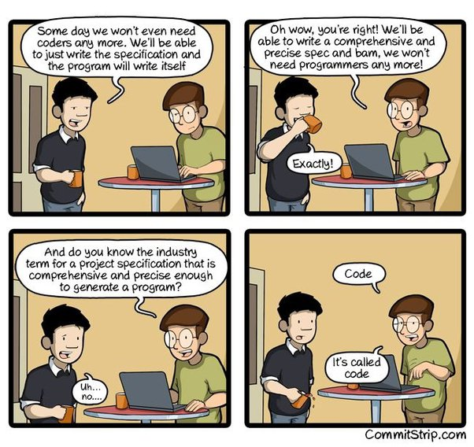

I chose the railway photo for the cover for a reason. TypeScript as a type system has many powerful and unique features. But people often do not know about them or neglect them. In this post, I want to highlight some common escape hatches that people use and why they make TypeScript feel like bloated JavaScript.

More often than not, we use TypeScript as bloated JavaScript. For example,

```typescript
{
  options: Record<string, string>
}
```

I would argue that this is why people keep saying that TypeScript doesn't add much value. In fact, this type tells me (or the users of my code) nothing about what the options are. Consider another example:

```typescript
{
  someField: string,
  [key: string]: unknown;
}
```

This is a fairly pointless type either.

The problem is that we think we have added value. In fact, all we did was ask the compiler to keep it quiet.

## Why use types at all?

The main reason people use types is to avoid ambiguity and increase confidence. Let’s be honest: can you imagine a large codebase all written entirely in JavaScript? Sure, it is possible. But eventually, we would have to implement all kinds of runtime checks and unit tests to verify things that the compiler could have verified. The cost of maintenance of such a codebase is much higher compared to a strongly typed one.

Okay, let’s step aside a bit. Consider the following snippet:

```typescript
if (val !== null) {
  doSomething(val)
}
```

This is a cliffhanger! What if the value is `null`? This is our job to think about the scenarios like this.

By the way, the exceptions are called exceptions because the computer ended up in an exceptional state. In other words, the way forward is not defined.


By writing code, we tell the computer to perform certain actions instead of us. But machines will strictly follow the instructions we give them. The program is the most accurate specification. So it is our job to make sure we don’t leave black spaces in this spec. And if the flow of execution is stuck, the best the machine can do is crash the program.



As you know, many languages avoid `exceptions`, `nulls`, `undefined`, `any` and those weird constructs listed above. This is to ensure that programmers cannot ship the code shown in the image above. For example, Rust [uses](https://doc.rust-lang.org/std/result/) `Result` instead of `null` (with two variants - `Ok` and `Err`, which the programmer has to deal with). In Haskell, the programmer [has to provide](https://en.wikibooks.org/wiki/Haskell/Control_structures) the `else` case. All this makes the flow of the program as defined as a railway system. No sudden interruptions. No run-time exceptions. Just an angry compiler.

TypeScript was born out of desperation because there were no types in JS, JS was the only option at the time, and the browser was becoming the platform. In other words, JS programs have been becoming ever more complex without a way to verify the correctness of those without involving people. However, to make it easier to adopt, TS introduced the escape hatches. Otherwise, it could easily have become another [PureScript](https://www.purescript.org/) (which is an amazing language, much more shippable, but harder to adopt). That's why we have to deal not only with `exception`s, `null`s and `undefined`s, but also with all sorts of weird object-like constructs and `any`s.

But we don’t have to.

## Narrow down the options

Guessing while coding takes a lot of energy, causes frustration, and leads to philosophical discussions in the nearest bar. TypeScript can help avoid this. Consider this (let's say we were maintaining this code):

```typescript
type Event = {
  // some fields
  action?: {
    type: string
    [key: string]: unknown
  }
  // more fields
}
```

This is a piece of valid TypeScript code. How many questions does this code snippet raise? First of all, why is `action` optional? What does that mean from the business logic perspective? Secondly, we'll have to guess (using find/grep, maybe) the `type` of the action. The `string` type is not an ideal choice here as most probably, down the road, we’ll have to match that string with some other finite set of strings. Lastly, the fact that this `action` object can have whatever key with an `unknown` value doesn’t help at all. We’ll have to use find/grep again to understand it. TypeScript will swallow this code, no problem. But we, humans, will have to come back to it after a while. So, as long as we’re not ready to adopt less forgiving language, it’s up to us to make it better.

So, what can we do differently?

> List your options, define the pathways.

Instead of using optional fields, use union type. For example, we could say, we have an “actionable event” or just a “data event”:

```typescript
type Event =
  | { type: 'ACTIONABLE', action: {...}, ... }  // #1
  | { type: 'DATA', ... }                       // #2
```

The consumer will have just two, self-describing variants to deal with:

```typescript
function handle(e: Event): void {
  if (e.type === 'ACTIONABLE') {
    // tsc knows this is the branch #1
    return;
  }
  // tsc knows this is the branch #2
  return;
}
```

([Playground](https://www.typescriptlang.org/play?useUnknownInCatchVariables=true#code/C4TwDgpgBAQghgZwgFXNAvFA3lAdnAWwgC4oFgAnAS1wHMAaKOWkvAVwICMIKoBfANwAoUJCgB5AMaS2YRFQD2uKOiFR1sRCjRQAZFAAUajSYA+2KKNYBycmwAmEXMGuN7VADZUWz0pwUKHhBwynzGJurmOFak1mAUCgBmEAgIChSuUIH2AMqSABYBHn5FwaHhUACUwkKJbLiSwIrK8TTAOcBsiYkGkBRpuKRSMnIIzZWkAG4KVPbYFVSJhn0DAHRWKuiYtp2OztaV8xEakkppQaseCrQG1gCSUADWuAoA7pb5VAhku04ujCslKt3F4fMBqhUTBQIJ0KLhhCYwiZTrhzhBLtdbg9nm8Pl8oPEkik0hkATw1tk8oVApUhHwgA))

Adding another path in our code (another type of event) becomes a lot easier. Moreover, this kind of code reflects the domain knowledge. TypeScript is very good at making types out of strings, we should leverage that!

By the way, an `If` is like a fork, and a `Switch` is like a mega-fork - either way, there are well-defined branches of the execution flow.


> Avoid using optional keys on objects.

Just look at it ?: - is it a broken smiley? Apart from jokes, if an object may or may not contain a key, this means something from the business logic perspective. it is always a sign of a fork down the road (like, `obj.key ? myFn(obj.key) : otherFn()`). So, why not make it explicit (like we did with the Event above) and distinguish both variants?

> Avoid vague records

Things like `Record<string, string>` are very convenient at the moment of writing, but defeat the purpose of having a type system in the long run. This is an escape hatch, so do try to avoid it. I would argue that it is better to use unknown in this case because TS will force runtime checks. For example,

```typescript
const bad: Record<string, string> = {};
const better: unknown = {};

const a = bad.abc; // happy TS
const b = better.abc; // angry TS

// We need to convince TS that we know what we are doing.
if (typeof better === 'object' && better !== null && 'abc' in better) {
  const c = better.abc; // happy TS
}
```

Without that convincing, our program would not compile ([playground](https://www.typescriptlang.org/play?useUnknownInCatchVariables=true#code/MYewdgzgLgBARgQwCYC4YCUCmoBOSA80OAlmAOYA0MRpZAfDALwwDeAvgNwBQokscmKFEw40AVzABrMCADuYJq05ce4aDASLESAHQI4wbr3Vwtg4Tj0HuXYgDMYACigBPAA6YQDgUJFNGzADkIHAAVthQgTAAZNHw5n4AhAEwYGIANukxcYH6wFGk8b44AJSsXDCVMMawwGbFVoZcbEA)).

I understand that sometimes (rather rarely though) we really don’t know the keys and the values. Maybe our code shouldn’t even know about them. But think twice before introducing this escape hatch.

> Use `Result` instead of throwing exceptions

The hype around Rust’s Result type is real and it was ported to TS. Let me introduce [ts-results](https://github.com/vultix/ts-results) - a wonderful little library that can help with avoiding all the issues associated with the exceptions.

The main idea is that your function should always return. Your program is in the flow, don’t interrupt it! So instead of this:

```ts
function divide(a: number, b: number): number { // this is an incomplete truth, btw if(b===0){
  if (b === 0) {
    throw new Error('Dividing by zero?');
    // the flow is interrupted, the program doesn't return
    // the user should know about it and wrap it in try-catch
    // we can sneak in an exception, nobody will notice until it blows up :P
  }
  return a/b;
}
```

... we can use this:

```ts
export type MathError =
  | { type: 'DIVISION_BY_ZERO' }
  | { type: '...' }
  | { type: '...' };

function divide(a: number, b: number): Result<number, MathError> {
  if (b === 0) {
    return new Err({ type: 'DIVISION_BY_ZERO' })
  }
  return new Ok(a/b);
}
```

Notice how we listed all the errors we could think of and we always return a value from the function. The caller of the function now has clearly defined two paths to follow - `Ok<number> | Err<MathError>`. By the way, you can .map or .mapErr over the Result type and the code results in a beautiful linear [railroad](https://fsharpforfunandprofit.com/rop/).

## Conclusion

I wanna wrap it up with ChatGTP-generated Hokku:

> In typed code’s embrace,
> Errors fade like morning mist,
> Maintained with surety.
